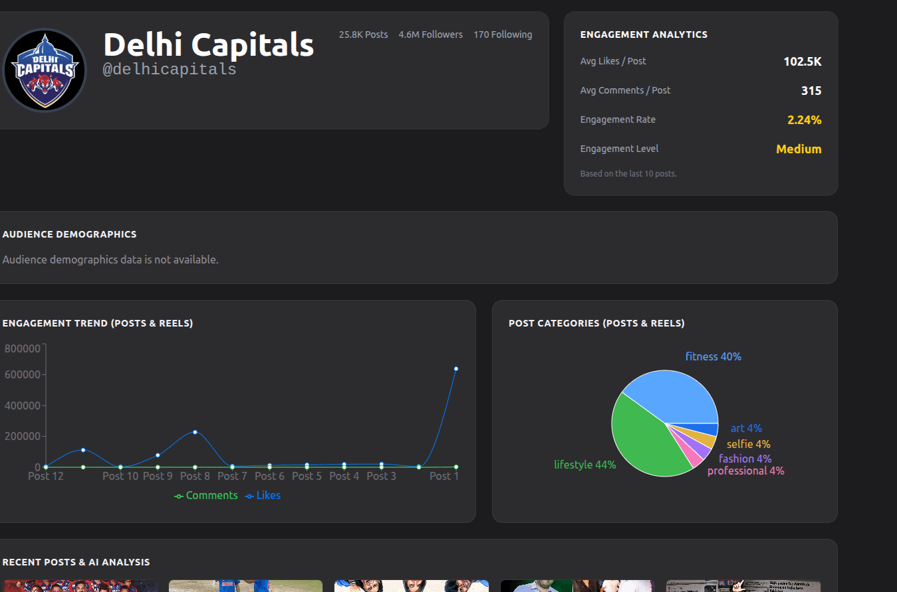
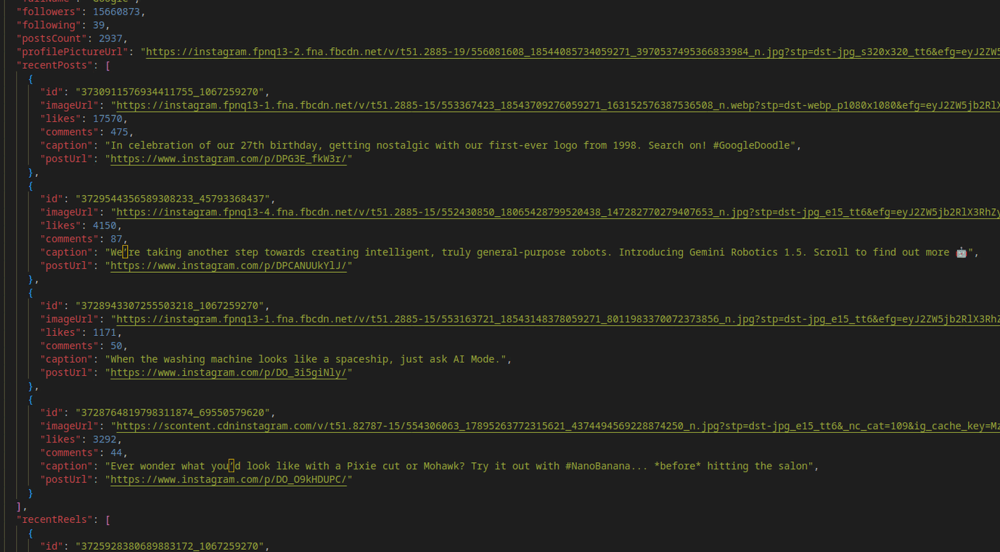

# Instagram Influencer Profile Dashboard

This full-stack web application provides a comprehensive, data-rich profile of any public Instagram influencer. It scrapes real-time data, enriches it with AI-powered analysis, and presents it in a clean, modern, and responsive user interface.




<p align="center">
  
  &nbsp;&nbsp;&nbsp;&nbsp;
  
</p>

[**Demo Video**](https://drive.google.com/drive/folders/1yZWPFLbig8taRdXZhSFBruDkbG6OgexP?usp=sharing)

---


## System Architecture and In-Depth Analysis

The application is a sophisticated pipeline that transforms raw, public data into actionable insights.


### 1. The Scraping Pipeline: A Deep Dive

The data pipeline's success hinges on its ability to bypass standard scraping protections. Instead of parsing HTML (which is fragile and often blocked), this project directly targets Instagram's internal JSON API, mimicking the behavior of a logged-in web browser.

1.  **Authenticated API Access & Browser Mimicry**:
    * The scraper's most critical component is the `cookies.json` file. This file contains session cookies (`sessionid`, `csrftoken`, `ds_user_id`) obtained from a real, logged-in browser session.
    * When making requests, the backend constructs a set of HTTP headers that precisely mimic a real browser (in this case, Chrome on Windows). This includes the `User-Agent`, `Referer`, `Accept-Language`, and several `X-IG-*` headers.
    * By sending the valid `sessionid` cookie along with these headers, the requests appear to Instagram's servers as legitimate traffic from an authenticated user, granting access to the more detailed internal API.

2.  **Two-Step Data Fetching**:
    * **Step 1: Get Profile Info & User ID**: The first API call is made to a `web_profile_info` endpoint:
        ```
        [https://www.instagram.com/api/v1/users/web_profile_info/?username=](https://www.instagram.com/api/v1/users/web_profile_info/?username=){username}
        ```
        This endpoint returns a JSON object with the influencer's core data: `full_name`, follower/following counts, post count, and, most importantly, their unique `id` (the `userId`).
    * **Step 2: Get Content Feed**: With the `userId`, a second, more powerful call is made to the user feed endpoint:
        ```
        [https://www.instagram.com/api/v1/feed/user/$](https://www.instagram.com/api/v1/feed/user/$){userId}/
        ```
        This is the key to getting the actual content. It returns a JSON array of the user's most recent media items in chronological order.

3.  **Data Segregation (Posts vs. Reels)**:
    * The scraper iterates through the returned feed items. It inspects the `media_type` field of each item to differentiate content:
        * `media_type: 1` -> A single image post.
        * `media_type: 2` -> A video (Reel).
        * `media_type: 8` -> A carousel/album post.
    * The code then intelligently extracts the necessary data for each type, including `like_count`, `comment_count`, and for Reels, the crucial `play_count`. It populates separate `recentPosts` and `recentReels` arrays to be sent to the frontend.

4.  **Database Caching**: The final, enriched profile object is saved to MongoDB. This serves as a 24-hour cache to minimize API calls and avoid rate-limiting, while a "Force Refresh" option provides on-demand updates.

### 2. AI-Powered Data Enrichment

Once the raw data is scraped, it's passed through two powerful AI models to generate deeper insights.

#### A. Content Analysis (Posts & Reels)

For each post and Reel, the thumbnail image is sent to the **Google Gemini Vision model**, which is multi-modal and can understand both images and text simultaneously.

* **Process**: The image URL is converted to a base64 string. This, along with the caption, is embedded in a highly specific prompt.
* **Prompt Engineering**: The prompt commands the AI to respond *only* with a JSON object, defining the exact keys (`tags`, `vibe`, `quality`) and the types of values expected. This structured output is crucial for reliability, preventing the AI from returning conversational text that would break the application.
* **Output**: This process enriches each piece of content with structured, analytical data that is then displayed on the frontend.

#### B. Audience Demographics Analysis (Bonus Feature)

Aggregated data from the influencer's profile is sent to a **Google Gemini text model**.

* **Process**: A detailed summary of the influencer's profile—including their bio, a compilation of recent captions, and the AI-generated tags from their posts—is compiled into a single, comprehensive prompt.
* **Inference, Not Facts**: This is a key distinction. The AI does **not** have access to Instagram's private follower data. Instead, it uses its vast knowledge base to **infer** the most likely audience demographics. It correlates the influencer's content themes (e.g., "luxury travel," "gaming"), language, and style with known demographic patterns to build a statistical persona of their typical follower.
* **Structured Visualization Data**: The prompt is engineered to request a JSON object with keys like `genderSplit`, `ageGroups`, and `topGeographies`, with values structured perfectly for use in the frontend's charts.

### 3. Analytics and Calculations

The backend performs several key calculations:

#### Engagement Rate

The engagement rate is a crucial metric for understanding an influencer's effectiveness. It's calculated with the following formula, based on the last 10 posts:

```Engagement Rate = ( (Average Likes + Average Comments) / Total Followers ) * 100```


-   **Average Likes**: Calculated as `Total Likes on recent posts / 10`.
-   **Average Comments**: Calculated as `Total Comments on recent posts / 10`.

This provides a percentage that represents how actively the influencer's audience engages with their content, normalized by their audience size. The result is then categorized into "Low," "Medium," or "High" for quick assessment.

## Features

* **Dynamic Profile Search**: Fetch any public Instagram profile by username.
* **Comprehensive Data**: Gathers all essential profile metrics, including follower/following counts, post counts, and more.
* **Post and Reel Analysis**: Displays the latest 10 posts and 5 Reels, complete with their respective engagement numbers (likes, comments, and views for Reels).
* **AI-Powered Content Analysis**: Each post and Reel thumbnail is analyzed to generate:
    * Relevant tags (e.g., 'fashion', 'travel').
    * A "vibe" classification (e.g., 'luxury', 'casual').
    * Quality indicators (lighting, visual appeal).
* **In-Depth Analytics**:
    * Calculates average likes, comments, and a detailed engagement rate.
    * Visualizes engagement trends over time with charts.
    * Displays post categories in a pie chart for at-a-glance content strategy analysis.
* **Audience Demographics (Bonus Feature)**: Utilizes a second AI model to infer and visualize the influencer's likely audience demographics, including gender split, age groups, and top geographical locations.
* **Smart Caching**: Implements a 24-hour cache for fetched profiles to improve performance and reduce redundant scraping. A "Force Refresh" option allows bypassing the cache for the latest data.
* **Modular Frontend**: Built with a clean, component-based architecture for maintainability and scalability.

---

## server/output.json or server/scraped.json



## Tech Stack

This project is a monorepo containing both the backend and frontend applications.

| Category          | Technology                                                                                                  |
| ----------------- | ----------------------------------------------------------------------------------------------------------- |
| **Frontend** | [**React**](https://reactjs.org/) (with Vite), [**Tailwind CSS**](https://tailwindcss.com/), [**Recharts**](https://recharts.org/) |
| **Backend** | [**Node.js**](https://nodejs.org/), [**Express**](https://expressjs.com/)                                     |
| **Database** | [**MongoDB**](https://www.mongodb.com/) (with Mongoose)                                                      |
| **Data Scraping** | Direct Authenticated API Calls                                                                              |
| **AI/ML** | [**Google Gemini API**](https://ai.google.dev/)                                                               |
| **Deployment** | Docker (for containerization)                                                                               |

### Key Packages

* **Server**: `express`, `mongoose`, `axios`, `dotenv`, `cors`.
* **Client**: `react`, `react-dom`, `recharts`, `lucide-react`, `tailwindcss`.

---


## Setup and Installation

### Prerequisites

* Node.js (v16 or higher)
* npm / yarn
* MongoDB Atlas account (or a local MongoDB instance)
* Google Gemini API Key

### Backend Setup (`/server`)

1.  **Navigate to the server directory**:
    ```bash
    cd server
    ```
2.  **Install dependencies**:
    ```bash
    npm install
    ```
3.  **Create an environment file**:
    * Rename `.env.example` to `.env`.
    * Add your MongoDB connection string and your Google Gemini API key:
        ```env
        MONGO_URI=your_mongodb_connection_string
        GEMINI_API_KEY=your_gemini_api_key
        ```
4.  **Add Instagram Cookies**:
    * Log in to Instagram in your web browser.
    * Using your browser's developer tools, export your cookies for the `instagram.com` domain as a JSON file.
    * Save this file as `cookies.json` in the `/server` directory. **IMPORTANT**: This file is included in `.gitignore` and should never be committed to your repository.
5.  **Start the server**:
    ```bash
    npm run dev
    ```
    The server will be running on `http://localhost:5000`.

### Frontend Setup (`/client`)

1.  **Navigate to the client directory**:
    ```bash
    cd client
    ```
2.  **Install dependencies**:
    ```bash
    npm install
    ```
3.  **Start the development server**:
    ```bash
    npm run dev
    ```
    The application will be available at `http://localhost:5173`.

---

## Assumptions Made

* The application is designed for public Instagram profiles only. Private profiles cannot be scraped.
* The scraping method relies on Instagram's internal API structure, which is subject to change and could break without notice.
* The AI-generated data (tags, vibe, demographics) is an inference based on public data and should be considered an educated estimate rather than a factual report.
* The "consistency" quality indicator is a subjective measure based on the last 10 posts and may not reflect the influencer's entire history.
